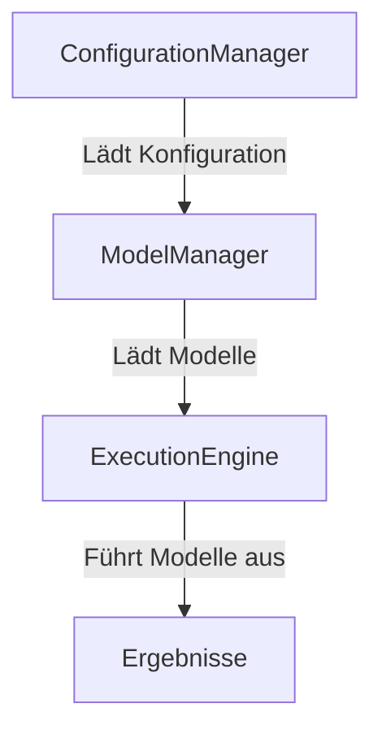

# Technische Spezifikation des ModelOrchestrator

## Übersicht
Der ModelOrchestrator ist ein System zur Verwaltung und Orchestrierung von Modellen. Er ermöglicht die einfache Integration, Verwaltung und Ausführung von Modellen in einer einheitlichen Umgebung.

## Architektur

### Komponenten
1. **ModelManager**: Verantwortlich für das Laden und Verwalten von Modellen.
2. **ConfigurationManager**: Verwaltet die Konfigurationen für die Modelle.
3. **ExecutionEngine**: Führt die Modelle aus und verwaltet die Ausführungsprozesse.

### Datenfluss

## Konfiguration
Die Konfiguration erfolgt über eine YAML-Datei, die im `config/` Verzeichnis abgelegt ist. Ein Beispiel finden Sie in `config/config.yaml`.

## Abhängigkeiten
- Python 3.8+
- PyYAML
- Weitere Abhängigkeiten sind in der `requirements.txt` aufgeführt.

## Verwendung
1. Konfigurieren Sie die Modelle in der `config/config.yaml`.
2. Führen Sie den ModelOrchestrator mit `python -m src.model_orchestrator` aus.
3. Die Ergebnisse werden in der angegebenen Ausgabeformat gespeichert.